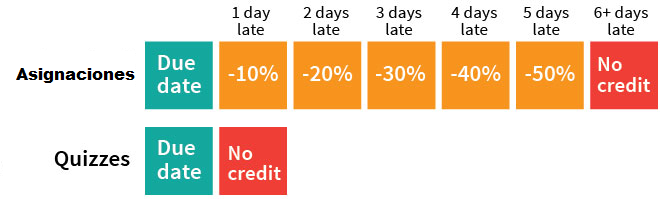

## 

---

--- .class #id 

## Libros guía

        
        
*** {name: left}
     

      
*** {name: right}
      
- **Análisis y Diseño de experimentos**
- Biblioteca UdeA: 658.5/G984
 
--- 

--- .class #id 

## Libros guía

        
        
*** {name: left}
     

      
*** {name: right}
      
+ __A Primer of Ecological Statistics__
+ Biblioteca UdeA: 574.5012/G683
      
--- 

--- .class #id 

## Libros guía

        
        
*** {name: left}
     

      
*** {name: right}
      
+ __Experimental design and data analysis for biologists__
      
+ Biblioteca UdeA: 574.015195/Q7
      
--- 

--- .class #id 
## Evaluación

__3 Examenes parciales: 65%__
      
+ Examen 1: 20 %
+ Examen 2: 25%
+ Examen 3: 20
      
      Roses are red, 
      violets are blue.
      
__Seguimiento: 35%__
      
+ Trabajo final: 15%
+ Asignacionaciones semanales: 15% 
+ Quices online: 5% 

---

## Asignaciones 

__Semanales__: 

+ Documento de _Word_: Máximo 4 páginas
+ Script R

---

        
