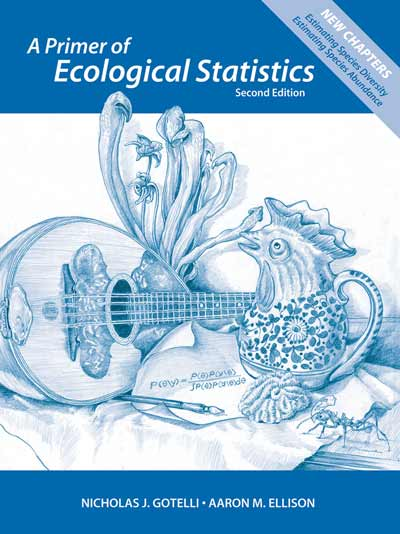

## 

---

--- .class #id 

## Libros guía

        
        
*** {name: left}
     

      
*** {name: right}
      
- **Análisis y Diseño de experimentos**
- Biblioteca UdeA: 658.5/G984
 
--- 

--- .class #id 

## Libros guía

        
        
*** {name: left}
     

      
*** {name: right}
      
+ __A Primer of Ecological Statistics__
+ Biblioteca UdeA: 574.5012/G683
      
--- 

--- .class #id 

## Libros guía

        
        
*** {name: left}
     

      
*** {name: right}
      
+ __Experimental design and data analysis for biologists__
      
+ Biblioteca UdeA: 574.015195/Q7
      
--- 

--- .class #id 
## Evaluación

__3 Examenes parciales: 65%__
      
+ Examen 1: 20 %
+ Examen 2: 25%
+ Examen 3: 20
      
      Roses are red, 
      violets are blue.
      
__Seguimiento: 35%__
      
+ Trabajo final: 15%
+ Asignacionaciones semanales: 15% 
+ Quices online: 5% 

---

## Asignaciones 

+ Semanales a partir de la segunda clase
+ Documento de _Word_: Máximo 4 páginas
+ Script R

---
## Quices online
 

+ Al menos 10 quices aleatorios online.
+ Los das peores notas serán borradas

---

## EDMODO: Espacio oficial del curso 

+ Toda información publicada es considerada oficial 
+ Cualquier contacto conmigo se hará vía mensaje edmodo
+ Dudas y preguntas también serán resueltas por esta plataforma

---

## El curso en resumen...

1. Repaso estadísica descriptiva

2. Introducción al Diseño de experimentos

3. Análisis de varianza

4. Métodos no-paramétricos

5. Regresión lineal 

---

## Software R 

El desarrollo del curso será asisitido por el uso del paquete estadístico R . 

<style="color:orange">https://www.r-project.org/

---

--- 

## Instalando R 

+ Windows:

<style="color:orange">https://www.icesi.edu.co/CRAN/bin/windows/base/

+ Mac: 

<style="color:orange">https://www.icesi.edu.co/CRAN/

---

## RStudio

Interfaz para manejo amigable de R. 

<style="color:orange">https://www.rstudio.com/products/rstudio/download/

